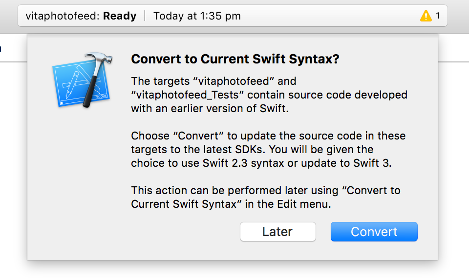
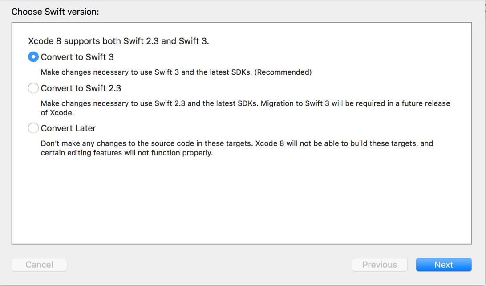
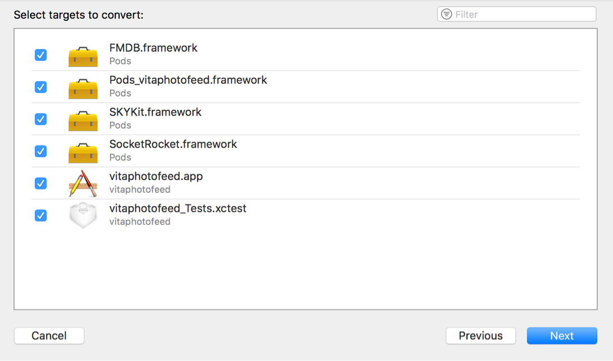
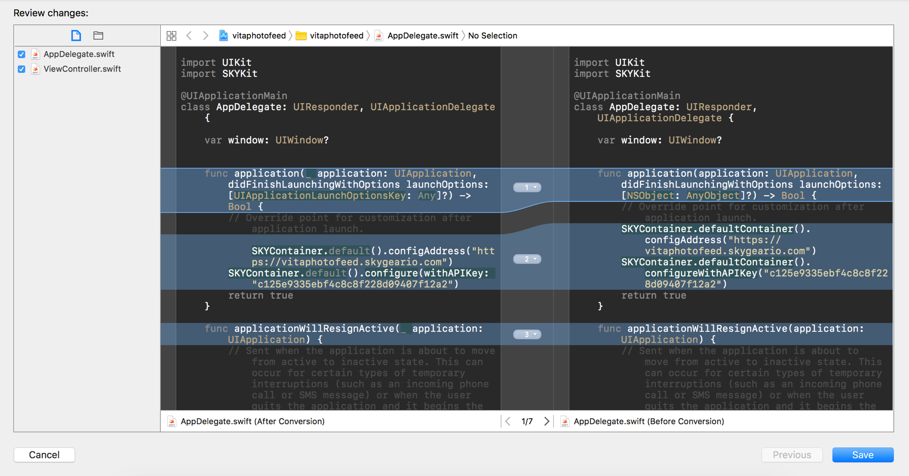
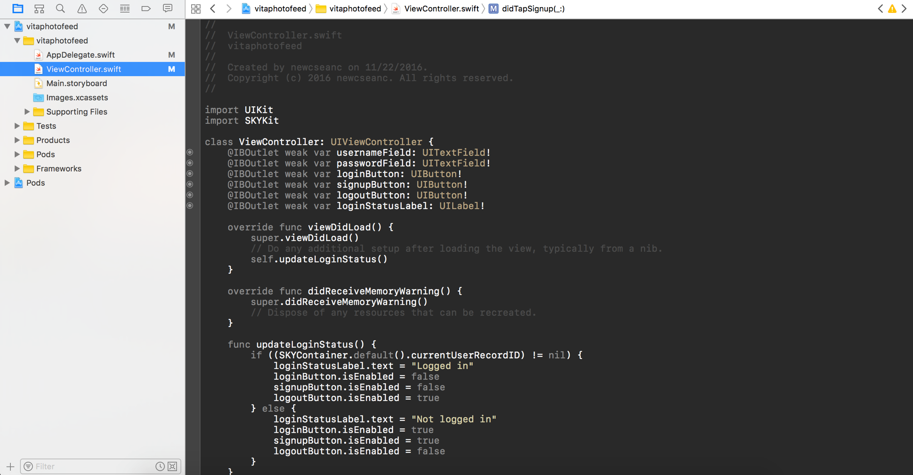
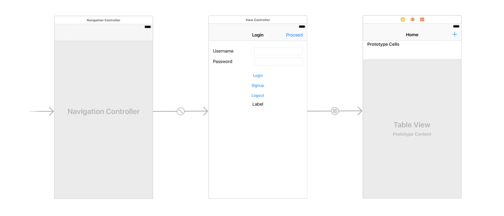
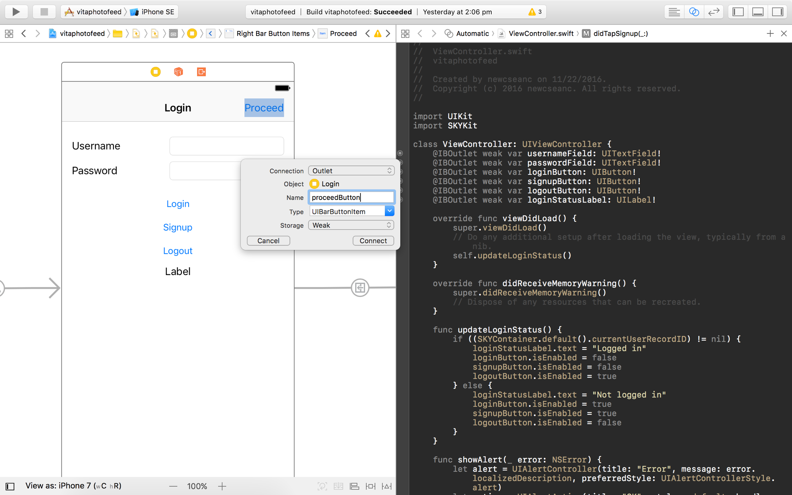
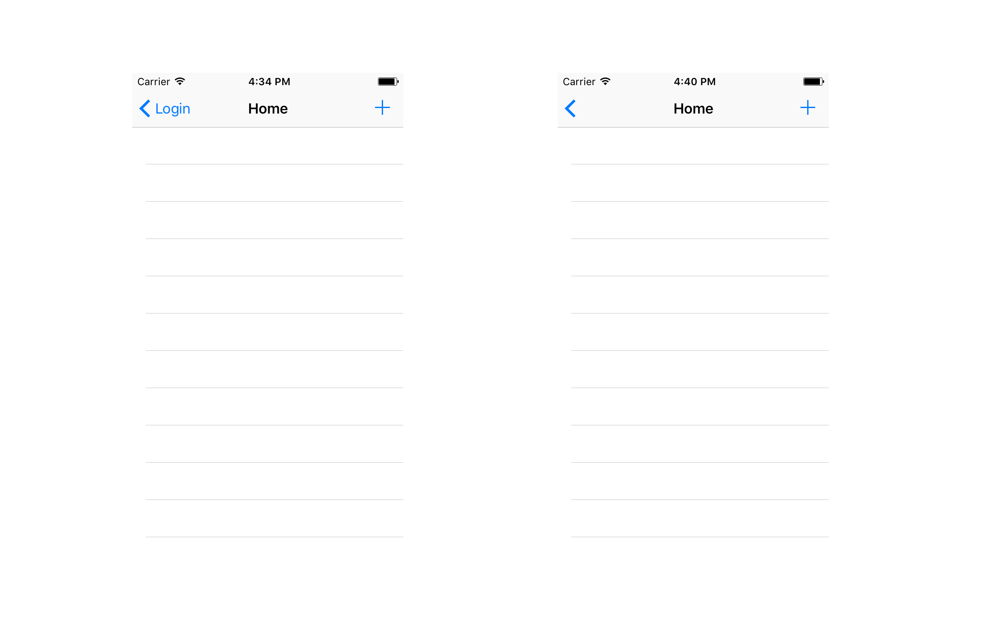
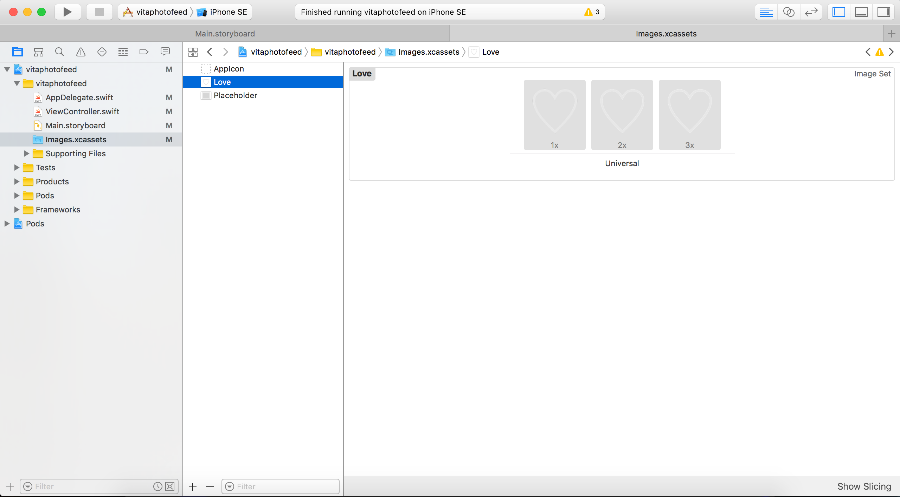

#swift-photofeed

In this tutorial, we are going to make a photo feed app, using Skygear as the backend.


Before getting started, here are the prerequisites:

- Xcode 8 or above
- Swift 3
- Cocoapods (You can refer to the [guide](https://guides.cocoapods.org/using/getting-started.html))
- A Skygear account (you can sign up [here](https://portal.skygear.io))


## Create New App

After signing up/logging in to the Skygear portal, you can see the screen below.


To create our photo feed app, just click on the **+ Create New App** box. You will be directed to the app creation page. Name the app **{your_name}photofeed**, in this case I will use the name "vita", so the app name is **vitaphotofeed**.


Click on **Create App** when you are done. You will be directed to the app dashboard. Follow the path *Getting Started > iOS > New App*, you will see the setup guide as shown below.


## Setup the App

For easier setup, we will show the steps here. Since we had **Cocoapods** installed, we will start by scaffolding the app. Open the **Terminal** on your Mac, navigate to the desired folder, and run the scaffolding command:

```sh
pod lib create --silent --template-url=https://github.com/SkygearIO/skygear-Scaffolding-iOS.git "vitaphotofeed"
```

In your case, you will replace *"vitaphotofeed"* with your *"{your_name}photofeed"*.

After finishing scaffolding, we will be prompted with few questions to setup the project:

```sh
What is your name?
> <your_git_username>

What is your email?
> <your_git_email>

What is your skygear endpoint (You can find it in portal)?
Example: https://myapp.skygeario.com
> https://vitaphotofeed.skygeario.com

What is your skygear API key (You can find it in portal)?
Example: dc0903fa85924776baa77df813901efc
> <your-api-key>

What language do you want to use?? [ Swift / ObjC ]
> Swift
```

For name and email, enter the username and email your use for Git. The *skygear endpoint* and *skygear API key* information is located in the portal with the path *Info > Server Detail*. Just copy and paste the values to answer the questions. For language, type in *Swift*.  

Upon answering all the questions, scaffolding will begin. After that, Xcode will open with the project Skygear scaffolded for you. You will be prompted whether to convert the syntax to the lastest Swift. Click on **Convert**.



Next, choose **Convert to Swift 3**, then click **Next**.



Tick all the targets, then click **Next**.



Finally, click **Save**.



You are not done yet, there is still one last step before the project is properly setup. In the Project Navigator of Xcode, open the file *ViewController.swift*, as in the picture below:



Then, convert all the NSLog() to print() to make it a Swift syntax.

In *ViewController.swift*, you have the code as below:

```swift
    @IBAction func didTapLogin(_ sender: AnyObject) {
        SKYContainer.default().login(withUsername: usernameField.text, password: passwordField.text) { (user, error) in
            if (error != nil) {
                self.showAlert(error as! NSError)
                return
            }
            NSLog("Logged in as: %@", user)
            self.updateLoginStatus()
        }
    }
    
    @IBAction func didTapSignup(_ sender: AnyObject) {
        SKYContainer.default().signup(withUsername: usernameField.text, password: passwordField.text) { (user, error) in
            if (error != nil) {
                self.showAlert(error as! NSError)
                return
            }
            NSLog("Signed up as: %@", user)
            self.updateLoginStatus()
        }
    }
    
    @IBAction func didTapLogout(_ sender: AnyObject) {
        SKYContainer.default().logout { (user, error) in
            if (error != nil) {
                self.showAlert(error as! NSError)
                return
            }
            NSLog("Logged out")
            self.updateLoginStatus()
        }
    }
```

Replace all the lines with NSLog() with print(), as in below:

```swift
    @IBAction func didTapLogin(_ sender: AnyObject) {
        SKYContainer.default().login(withUsername: usernameField.text, password: passwordField.text) { (user, error) in
            if (error != nil) {
                self.showAlert(error as! NSError)
                return
            }
            print("Logged in as \(user)") // Here
            self.updateLoginStatus()
        }
    }
    
    @IBAction func didTapSignup(_ sender: AnyObject) {
        SKYContainer.default().signup(withUsername: usernameField.text, password: passwordField.text) { (user, error) in
            if (error != nil) {
                self.showAlert(error as! NSError)
                return
            }
            print("Signed up as \(user)") // And here
            self.updateLoginStatus()
        }
    }
    
    @IBAction func didTapLogout(_ sender: AnyObject) {
        SKYContainer.default().logout { (user, error) in
            if (error != nil) {
                self.showAlert(error as! NSError)
                return
            }
            print("Logged out") // And finally here
            self.updateLoginStatus()
        }
    }
```

Now, all the code in the project is of the latest Swift syntax. Before finishing the setup, there is one last thing to do: the **SkyKit** installed by Cocoapods is v0.13.0, which is outdated. To correct these, we are going to install the latest **SkyKit** (v0.19.0) as of the writing of this article.

To do that, open Finder or Terminal and navigate to the project directory. You will see a **Podfile** in this directory.


Open the Podfile with your favorite text editor, and change the version of **SkyKit** from **v0.13.0** to **v0.19.0**, as shown below:

```ruby
use_frameworks!

target 'vitaphotofeed' do
  pod 'SKYKit', '~> 0.19.0' #Changed from 0.13.0
end
```

Now, we need to install the latest pod by running the following command using **Terminal** on the Podfile directory:

```sh
pod install
```

Finally, we're done setting up the project. You can now re-open the project by double clicking on *{your_name}photofeed.xcworkspace* using **Finder**.

## Laying out the Overall Design



The picture above show the storyboard of the photo feed app. We will have a **UINavigationController** as the main navigator of the app, and a **Login UIViewController** as the root controller of the navigation controller. Once the user has logged in, he/she can proceed to the **Home UITableViewController**.

In Xcode, open **Main.storyboard** in the project navigator. By default, the **Login UIViewController** has already been scaffolded for you. What you need to do are:

1. Drag and drop a **UINavigationController** into the storyboard.
2. Detach the connected **UITableViewController** from the **UINavigationController**.
3. Make the **UINavigationController** the initial view controller of the app.
4. Make the **Login UIViewController** the root view controller of the **UINavigationController.**
5. Change the **UINavigationBar title** of the **Login UIViewController** to *"Login"*. Drag and drop a **Bar Button Item** onto the top right of the **UINavigationBar** and name it *"Proceed"*.
6. Change the **UINavigationBar title** of the **Home UITableViewController** to *"Home"*. Drag and drop a **Bar Button Item** onto the top right of the **UINavigationBar** and make it a system icon *Add*.
7. Connect the **Proceed Button** of the **Login UIViewController** to the detached **Home UITableViewController** with a default show segue. (By selecting the **Proceed Button** and *Ctrl + Drag* to the **Home UITableViewController**)

There you go, the overall layout is done!

## Working on Login UIViewController

Most of the logic for the **Login UIViewController** has already been scaffolded for you in the corresponding file **ViewController.swift**. What we need to implement is to show/hide the **Proceed button** after users signed up, logged in, and logged out of the app.

To do this, we will open the side-by-side view. First, open **Main.storyboard**, and select **Login UIViewController**. Then, click on the **Assistant Editor** (the one on top right corner of Xcode, with two circles tangled together). Now you will have a side-by-side view of the storyboard layout of **Login UIViewController** and the logic file **ViewController.swift**.



Press **Ctrl** and click on the **Proceed Button** at the same time, then drag it to **ViewController.swift** right below the line:

```swift
@IBOutlet weak var loginStatusLabel: UILabel!
```

Enter the name *"proceedButton"* in the name field of the pop out box, then click **Connect**. You've successfully connected **Proceed Button** to the logic file.

We need to implement the show/hide logic of the **Proceed Button** whenver the login status is updated; therefore, we will write it in the following function:

```swift
func updateLoginStatus() {
        if ((SKYContainer.default().currentUserRecordID) != nil) {
            loginStatusLabel.text = "Logged in"
            loginButton.isEnabled = false
            signupButton.isEnabled = false
            logoutButton.isEnabled = true
            
            proceedButton.title = "Proceed" // 1
            proceedButton.isEnabled = true // 2
        } else {
            loginStatusLabel.text = "Not logged in"
            loginButton.isEnabled = true
            signupButton.isEnabled = true
            logoutButton.isEnabled = false
            
            proceedButton.title = "" // 3
            proceedButton.isEnabled = false // 4
        }
    }
```

Line numbered 1, 2, 3, 4 are what we need to add to the existing function **updateLoginStatus()**. Line 1 and 2 are used to show the **Proceed Button** when users are logged in, while Line 3 and 4 are used to hide the **Proceed Button** when users are not logged in / logged out.

Click and run the app on a simulator. Sign up for an account, or log in if you've already created one. Then, tap on the **Proceed Button**.



You will notice that there is a *"Login"* word at the top left corner of the **Back Button** as in the left picture above. To remove the *"Login"* word, we will add the following lines in **ViewController.swift**, right below the *override func viewDidLoad()*:

```swift
      override func prepare(for segue: UIStoryboardSegue, sender: Any?) {
        // Remove text from back button on next controller
        let backBarButtonItem = UIBarButtonItem()
        backBarButtonItem.title = ""
        navigationItem.backBarButtonItem = backBarButtonItem
    }
```

Run the app on simulator again. Now you will have a clean back button.

## Laying out the Design of Home UITableViewController

Before mingling with the storyboard, let's first import the required icons into Xcode. You can download the required icons [here](IconAssets.zip). Once downloaded, open **Images.scassets** in Xcode, then add **Love** and **Placeholder** image assets. Finally, drag and drop the downloaded icons into each of the image asset according to their sizes.

